# SQL Cinema Analysis 🎬

## 📊 Overview
This project analyzes cinema data using SQL to extract insights related to movie rentals, revenue, categories, and customer behavior.

## 🛠️ Tools
- SQL
- SQLite / DB Browser

## 🔍 SQL Concepts Used
- JOINs
- GROUP BY and Aggregations
- Subqueries
- Common Table Expressions (CTEs)
- Window Functions

## 📈 Analysis Highlights
- Identified top rented movies
- Calculated revenue by category
- Compared movie performance by rentals and revenue
- Measured average rental duration
- Analyzed customer activity and spending
- Detected unrented movies

## 📊 Results

### Tickets per Genre
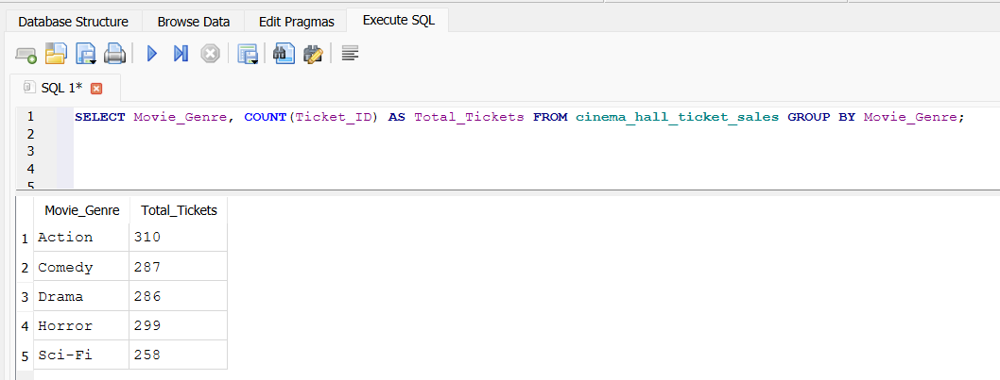

### Persons per Ticket
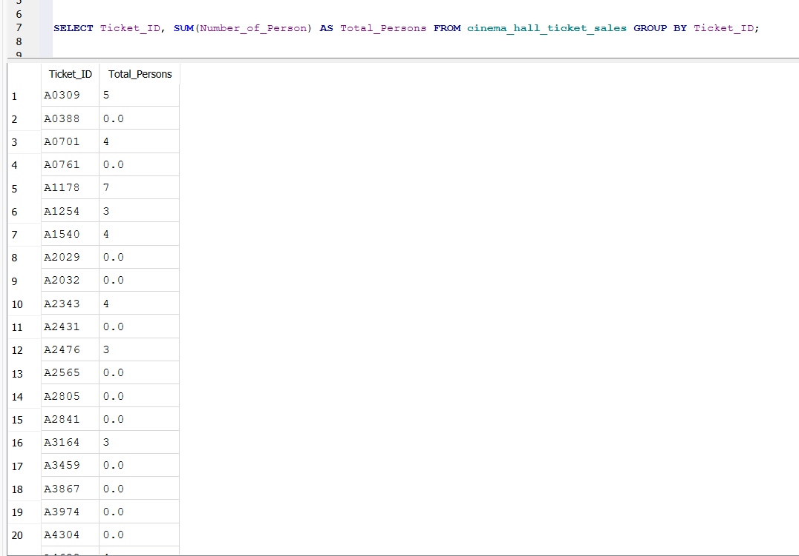

### Most Preferred Seat
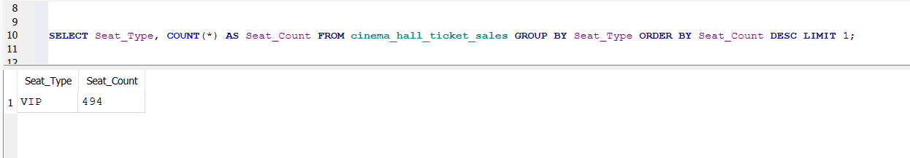

### Purchase Again Percentage
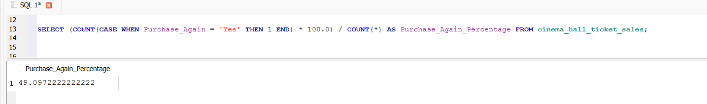

### Average Age VIP
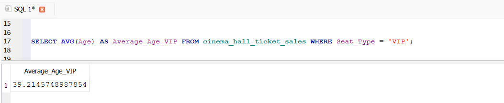

### Tickets per Seat Type
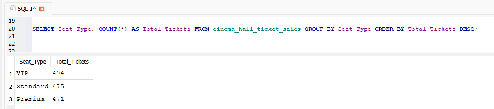

### Revenue per Seat Type
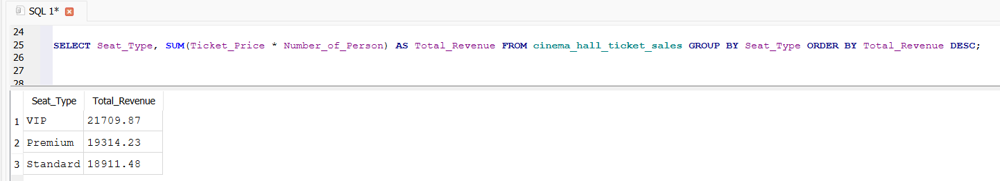

### Repeat Customers by Genre
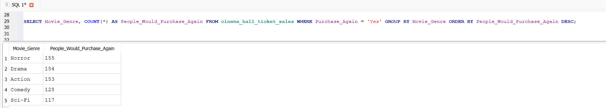

### Genre Seat Distribution
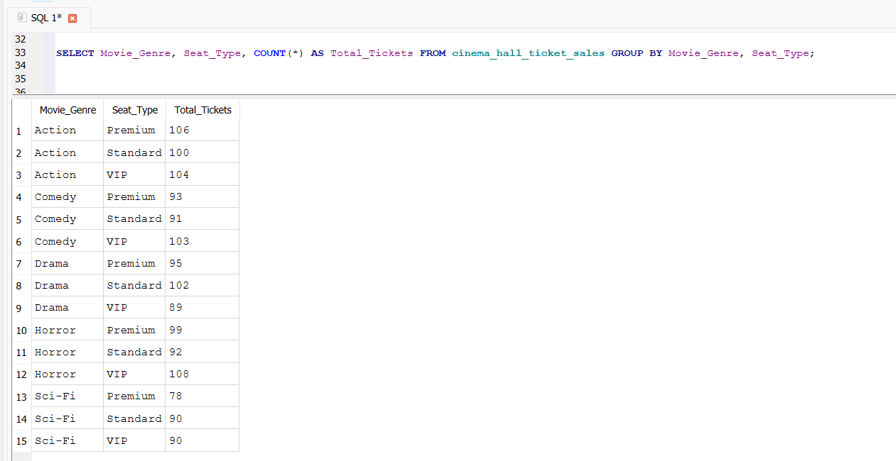

### Revenue per Genre
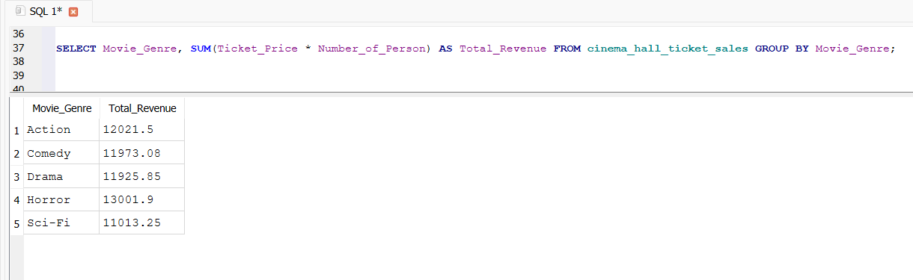

### Top Genre Seat Combination
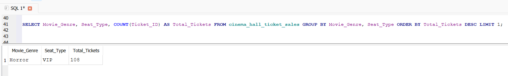

### Age Group Distribution
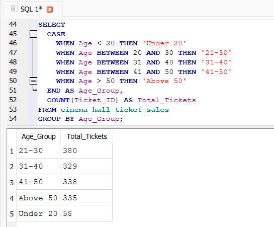
